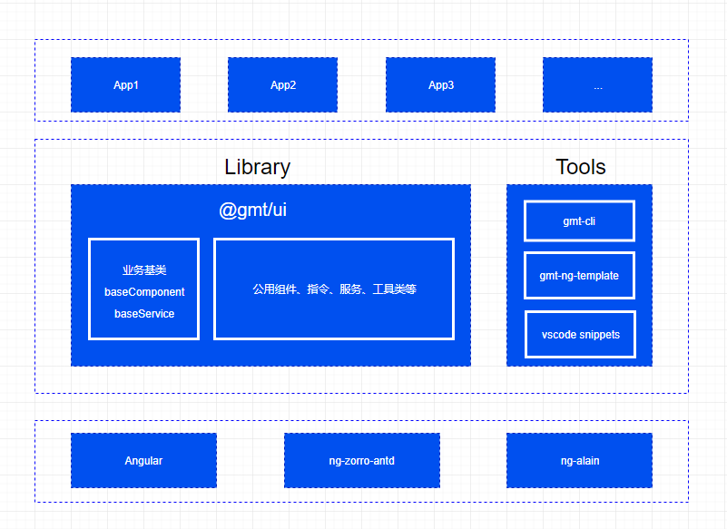

<h1 align="center">gmt-ng-template</h1>

  药极客angular前端模板工程

## 基础

+ [angular](https://angular.cn/)
+ [rxjs](https://rxjs-dev.firebaseapp.com/api)
+ [ng-zorro-antd](https://ng.ant.design/docs/introduce/zh)
+ [ng-alain](https://ng-alain.com/docs/getting-started/zh)
+ [gmt-ui](https://www.npmjs.com/package/@gmt/ui)
+ [gmt-cli](https://www.npmjs.com/package/@gmt/cli)

## 架构图

## 更多

[变更日志](CHANGELOG.md)

[贡献指南](CONTRIBUTING.md)
